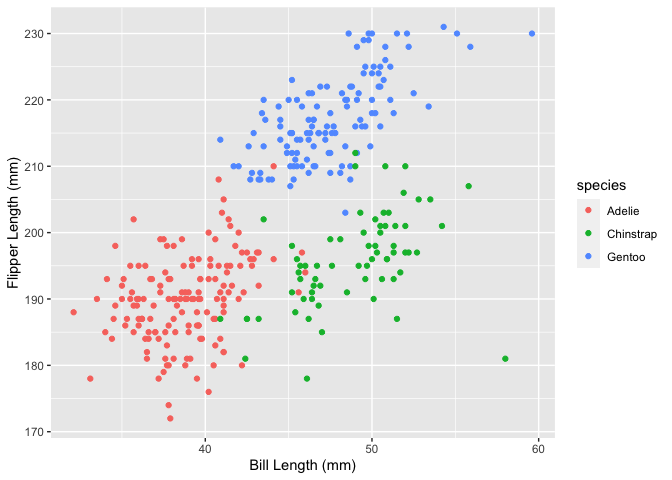

Data Science Homework 1
================
Keming Zhang kz2411
9/25/2021

## Problem 1

``` r
#set dataframe
set.seed(1)
df <- tibble(
  normal_10 = rnorm(10, mean = 0, sd = 1),
  vec_logical = normal_10 > 0,
  vec_character = c("a","b","c","d","e","f","g","h","i","j"),
  vec_factor = factor(c("l","m","n","l","m","n","l","m","m","l"))
)
```

``` r
mean_normal <-  mean(pull(df, "normal_10"))
mean_normal
```

    ## [1] 0.1322028

``` r
mean_logical <-  mean(pull(df, "vec_logical"))
mean_logical
```

    ## [1] 0.6

``` r
mean_character <- mean(pull(df, "vec_character"))
```

    ## Warning in mean.default(pull(df, "vec_character")): argument is not numeric or
    ## logical: returning NA

``` r
mean_character
```

    ## [1] NA

``` r
mean_factor <- mean(pull(df, "vec_factor"))
```

    ## Warning in mean.default(pull(df, "vec_factor")): argument is not numeric or
    ## logical: returning NA

``` r
mean_factor
```

    ## [1] NA

The mean of a random sample and a logical vector work. The mean of a
character vector and a factor vector do not work.

``` r
#convert logical
as.numeric(pull(df, "vec_logical"))

#convert character
as.numeric(pull(df, "vec_character"))

#convert factor
as.numeric(pull(df, "vec_factor"))
```

as.numeric function succeeds to convert logical and factor variables,
but fails to convert character vector.  
Because it is the setting of as.numeric function that it cannot convert
the character strings except it is composed of the character of
number.  
It helps. When taking the mean, R will convert logical variables into
numeric variables automatically, except character and factor variables.

## Problem 2

``` r
data("penguins",package = "palmerpenguins")
```

The data in this dataset is about penguins. The size of the dataset is
344 rows and 8 columns. There are 8 variables in the dataset.  
They are species, island, bill\_length\_mm, bill\_depth\_mm,
flipper\_length\_mm, body\_mass\_g, sex, year. And their types
successively are factor, factor, numeric, numeric, integer, integer,
factor and integer.  
The mean flipper length is 200.9152047mm.

``` r
scatterplot <- ggplot(penguins,aes(x = bill_length_mm, y = flipper_length_mm, color = species)) + geom_point(na.rm = TRUE) +xlab("Bill Length (mm)") + ylab("Flipper Length (mm)")
scatterplot
```

<!-- -->

``` r
ggsave("./scatterplot.png", scatterplot)
```

    ## Saving 7 x 5 in image
